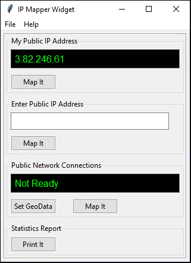
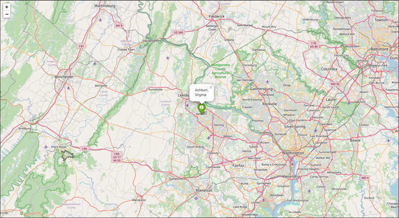

# CS50 Final Project - IP Mapper

If your reading this, your computer has network connections to other systems that could be anywhere, globally. The purpose of this project is to provide a visual display of the source of those IP connections on a dynamic map.

This project is a Windows GUI application developed with Python, leveraging Tkinter for the GUI Interface, and a SQLite3 database.    

Main features include:  

- Display a computers public NAT IP address
- Display the source location of a manually public IP Address
- Collect all active IP connections on your computer then display with markers on a map
- Generate a tabulated HTML table with all IP connections with their location

A demonstration of the video can be found at: https://youtu.be/W19ky5GfJUs 

<p align="left" width="100%">
  
  
</p>


# Python Libraries Used

Libraries from other contributors used, include:

- IPinfo - translates IP Addresses to geolocation data
- ipaddress - simplifies working with IP Addresses
- folium - plots gps coordinates on a map
- tkinter - provides the GUI interface
- sqlite - database


# Project Setup on Windows

## Environment Setup

Install [Python for Windows](https://gitforwindows.org)

Clone the project from GitHub and run the following in PowerShell:

```
cd cs50-final-project
python -m venv venv
venv\Scripts\Activate.ps1
pip install -r requirements.txt
```

## API Key

Register to obtain a free API key at [ipinfo.io](https://ipinfo.io/) for translating IP Addresses to geolocation data.  

## Environment Variable

Create a new User Variable

1. Run: `sysdm.cpl`
2. Click Advanced tab
3. Click Environment Variables
4. Click New under User Variables
5. Enter: 
   1. Variable name: API_KEY
   2. Variable value: {YOUR_API_KEY}


## Application Usage
Launch the application:  
`python main.py`  
