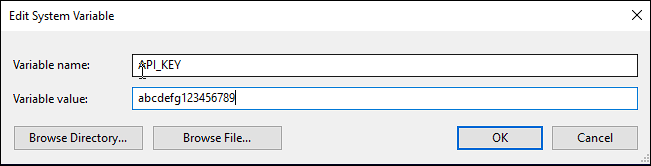

# CS50 Final Project - IP Mapper

IP Mapper Widget for Windows is my final project for Harvard's CS50 Introduction to Computer Science.


## Overview

This project is a Windows GUI application developed with Python, leveraging Tkinter for the GUI Interface. The main purpose of this application is to display the source of IP Addresses on a global map using your default Web Browser.   

Main features of this application include:  

- Display computers public NAT'd IP address
- Display the source location of an entered IP Address
- Collect all active IP connections on your computer and display with markers on a map
- Generate a tabulated HTML table with all IP connections with their location

A demonstration of the video can be found at: http://someurl.youtube.com

## Python Libaries

The project relies on many libraries from other contributors, including:

- IPinfo - translates IP Addresses to geolocation data
- ipaddress - simplifies working with IP Addresses
- folium - plots gps coordinates on a map
- tkinter - provides the GUI interface
- sqlite - database

## Prerequisites

### Installation

Create a Python virtual envirorment
`python3 -m venv venv`

Either use `pip install -r requirements` or run the following commands:

- pip install ipinfo
- pip install ipaddress
- pip install psutil
- pip install folium
- apt install python3-tk

### IPINFO Registration

Register for your free API key at [ipinfo.io](https://ipinfo.io/) for translating IP Addresses to geolocation dada.  

After registration, create a new System Variable
API_KEY={YOUR_API_KEY}



After registration, change line 35, entering your own API Key  
`access_token = '123abc'`


# Environment Setup

Install VSCode  

https://gitforwindows.org  
Install Git for Windows  

https://www.python.org  
Install Python for Windows  

python get-pip.py  

create venv   
python3 -m venv venv  

https://pypi.org/project/ipinfo/  
pip install ipinfo  

https://pypi.org/project/ipaddress/  
pip install ipaddress  

https://pypi.org/project/psutil/  
pip install psutil  

https://pypi.org/project/folium/  
pip install folium  

apt install python3-tk  


# What I learned / Skills / Challenges


I started out using a library named `geocoder` which was easy to use and provided required geolocation data  for a given IP Address. However, as the application was being developed, I received an error  `Too many requests` from ipinfo.io. That's when I switched to the IPinfo library, requiring a free registration for an API key and access to 50,000 requests per month.

Using folium is a breeze, it's feature rich and easy to use. Feed it data provided by IPinfo and it creates interactive maps with markers.

Collected data is stored in a SQLite database and cleared everytime the application is started.

There is a learning curve to using Tkinter for building a GUI applications. There is a lot of repetitive code for building the different components. I also found that it's easy to break the application when attempting to combine some of the statements.

Overall, I learned a lot from this project, it was both fun and challenging. I also can't say enough about the CS50 course, it's top notch, fast paced and you will find yourself ...


Project 

```bash
# tkinter
pip install tk
pip install geocoder
pip install folium
pip install pywebview  # only supports < python 3.8
pip install sofi
pip install tkhtmlview

import ipaddress
https://docs.python.org/3/library/ipaddress.html

```
